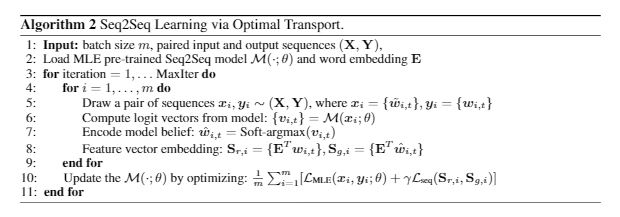

# OT-Seq2Seq
This is the repository for ICLR 2019 paper [IMPROVING SEQUENCE-TO-SEQUENCE LEARNING
VIA OPTIMAL TRANSPORT](https://arxiv.org/pdf/1901.06283.pdf)

## Usage ##
Folder [nmt](./nmt) is built upon [GoogleNMT](https://github.com/tensorflow/nmt).
Please follow the instructions in that repo for dataset downloading and code testing.

Folder [texar](./texar) is built upon [Texar](https://github.com/asyml/texar).
Details about summarization and translation tasks, please follow this [link](./texar).

## Brief introduction ##

We present a novel Seq2Seq learning scheme that leverages optimal transport (OT) to construct sequence-level  loss.   Specifically,  the  OT  objective  aims  to  find  an  optimal  matching  of  similarwords/phrases between two sequences, providing a way to promote their semantic similarity (Kusneret al., 2015). Compared with the above RL and adversarial schemes, our approach has: (i) semantic-invariance, allowing better preservation of sequence-level semantic information; and (ii) improved robustness, since neither the reinforce gradient nor the mini-max game is involved. The OT loss allows end-to-end supervised training and acts as an effective sequence-level regularization to the MLE loss.

To incorporate Seq2Seq learning model, OT can be easily applied to any Seq2Seq learning framework, the framework figure is shown here:  


Therefore, the training algorithm can be represented as:



### Reference
If you are interested in our paper and want to further improve the model, please cite our paper with the following BibTex entry:
```
@article{chen2019improving,
  title={Improving Sequence-to-Sequence Learning via Optimal Transport},
  author={Chen, Liqun and Zhang, Yizhe and Zhang, Ruiyi and Tao, Chenyang and Gan, Zhe and Zhang, Haichao and Li, Bai and Shen, Dinghan and Chen, Changyou and Carin, Lawrence},
  journal={ICLR},
  year={2019}
}
```